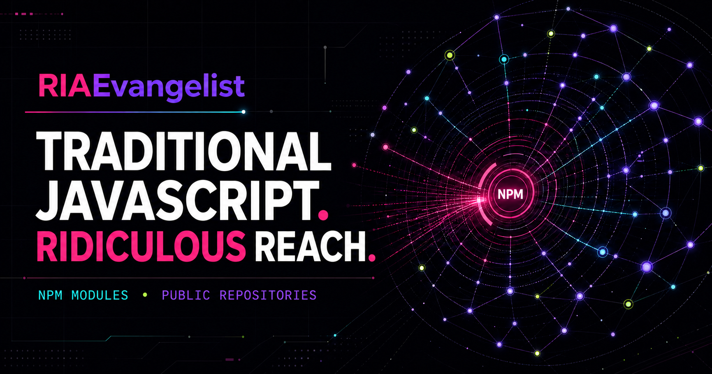
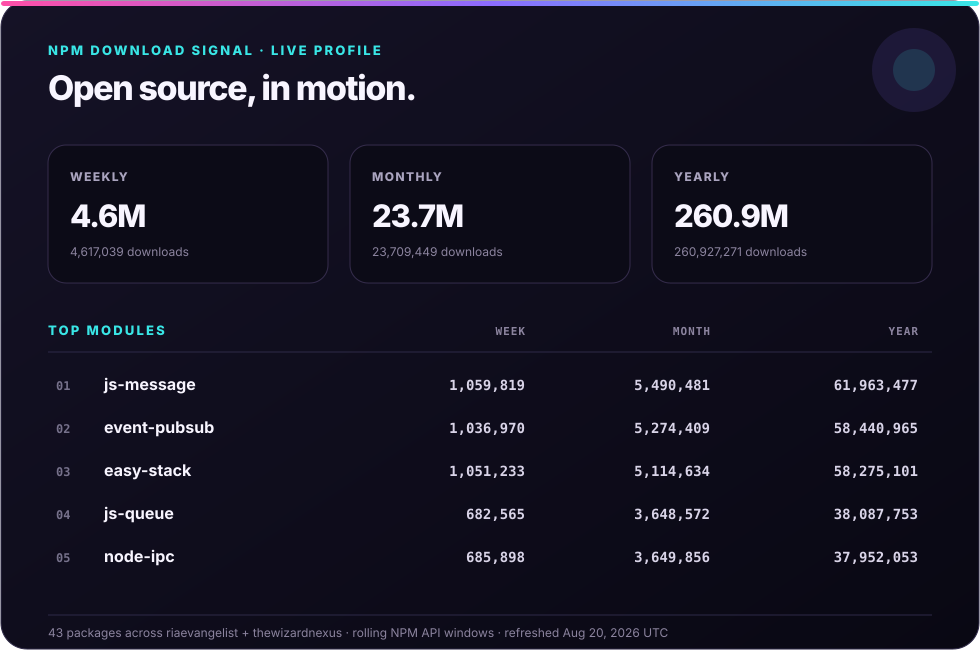
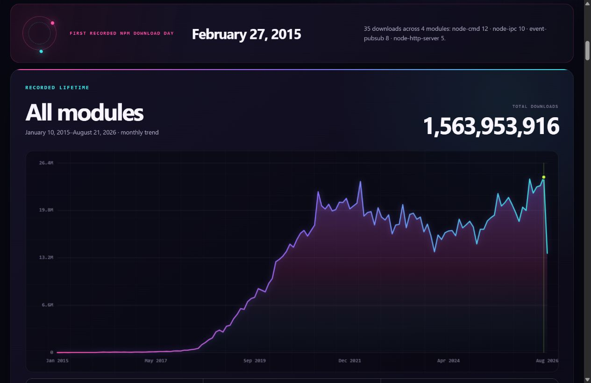
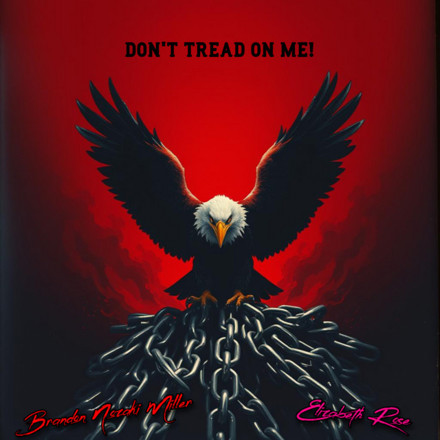
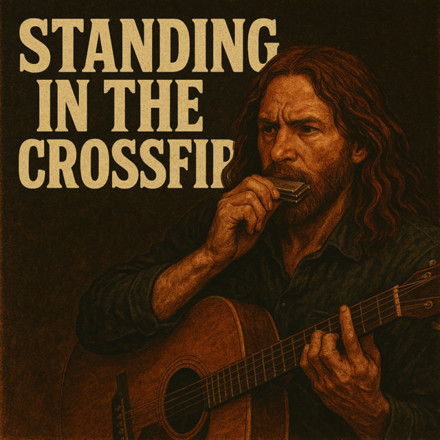
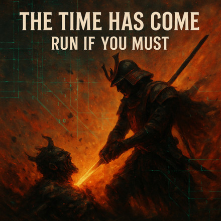
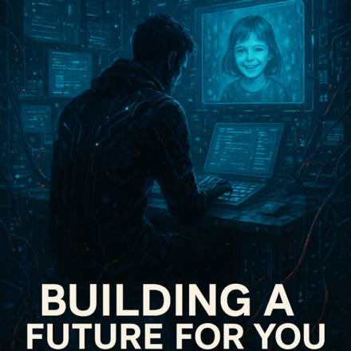
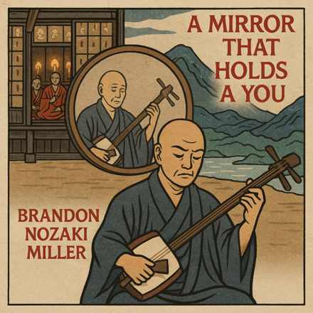
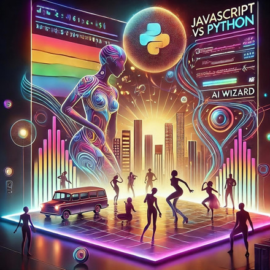

  

<!-- profile-npm-history:start -->

  <a href="https://riaevangelist.github.io/RIAEvangelist/"><strong>Explore the live open-source dashboard →</strong></a> 
  <strong>1.56+ billion recorded NPM package downloads since February 27, 2015</strong>

<!-- profile-npm-history:end -->

# Roshi _ _

### RIAEvangelist

**USAF Veteran · Traditional JavaScript Engineer · AI Whisperer · Creator · Mental Health Advocate**

   

  

*Building useful technology and stronger communities, with clarity, compassion, and a little less noise.*

## Open-source reach

  

<!-- profile-telemetry-counts:start -->

  <strong>43 maintained NPM modules · 125 public repositories · two owned identities</strong> 
  <a href="https://riaevangelist.github.io/RIAEvangelist/"><strong>Explore the live package pulse and complete code atlas →</strong></a>

<!-- profile-telemetry-counts:end -->

  

Historical snapshot through August 16, 2026 — open the live dashboard for current totals.

The dashboard totals every public package currently maintained by the owned [`riaevangelist`](https://www.npmjs.com/~riaevangelist) and [`thewizardnexus`](https://www.npmjs.com/~thewizardnexus) identities, shows weekly, monthly, yearly, calendar-year, and recorded-lifetime downloads per module, and explains the public repositories across both GitHub accounts. Counts use the official NPM API and refresh automatically each day. They represent package downloads—not unique people or verified installations.

## Earned milestones

   

[Read the racing chapter—records, Pikes Peak, and long-distance electric riding →](https://riaevangelist.github.io/RIAEvangelist/story/racing/)

### GitHub trophy case

## Current focus

### Veterans & mental health

 

As a USAF veteran and mental health advocate, I am working to make support more human, accessible, and stigma-free. The focus is on practical tools, community, and honest conversations that respect lived experience, especially for veterans navigating transition, isolation, and mental-health challenges.

[Read the service & community chapter →](https://riaevangelist.github.io/RIAEvangelist/story/service/)

### Entrepreneurship & Zen

 

I explore entrepreneurship as a practice: create useful things, learn in public, serve people well, and build systems that can last. Zen shapes how I approach that work: attention over noise, simplicity over ceremony, and steady progress without attachment to hype.

[Read the Japan & Zen chapter →](https://riaevangelist.github.io/RIAEvangelist/story/japan-zen/)

### Technology & open source

   

I build with traditional JavaScript, Node.js, AI-assisted workflows, and open-source tools. I am especially interested in technology that gives people more agency, makes complex systems understandable, and turns ambitious ideas into practical outcomes.

[Read the technology chapter—from bionic vision to local-first tools →](https://riaevangelist.github.io/RIAEvangelist/story/technology/)

## Live GitHub dashboard

[Open the live package pulse and complete code atlas →](https://riaevangelist.github.io/RIAEvangelist/)

 

 

## Follow the work

- [Choose a channel on the profile site](https://riaevangelist.github.io/RIAEvangelist/story/channels/) for a short guide to music, racing, builds, and experiments.
- [Watch on YouTube](https://www.youtube.com/brandonnozakimiller) for technology, AI, entrepreneurship, mental health, and the human side of building.
- [Connect on LinkedIn](https://www.linkedin.com/in/turtlesallthewaydown/) for professional updates and collaboration.
- [Explore my repositories](https://github.com/RIAEvangelist?tab=repositories) for open-source projects and experiments.

<!-- profile-music-catalog:start -->
## Music catalog

  <a href="https://riaevangelist.github.io/RIAEvangelist/music/"><strong>Explore all 36 releases, short collections, and individual release workspaces →</strong></a>

**Authorship note:** Most vocals are performed by Brandon and other real people. AI voices were used more at the beginning and are now occasional; Brandon performs some instruments, and AI remains a heavily used creative and production partner. [See how the music is made →](https://riaevangelist.github.io/RIAEvangelist/music/process/) · [Start with the origins →](https://riaevangelist.github.io/RIAEvangelist/music/origins/)

<table>
  <tr>
    <td width="20%"></td>
    <td width="20%"></td>
    <td width="20%"></td>
    <td width="20%"></td>
    <td width="20%"></td>
  </tr>
  <tr>
    <td width="20%"></td>
    <td width="20%"></td>
    <td width="20%"></td>
    <td width="20%"></td>
    <td width="20%"></td>
  </tr>
</table>

Ten releases from the current listening desk. Choose a service below, or use **LANDR** for every available destination.

| Release workspace | Listen |
| --- | --- |
| [**Three Wishes for My Attorney Bernie**](https://riaevangelist.github.io/RIAEvangelist/music/releases/three-wishes-for-my-attorney-bernie/) |      · [LANDR ↗](https://artists.landr.com/991043380511) |
| [**Don't Tread On Me!**](https://riaevangelist.github.io/RIAEvangelist/music/releases/dont-tread-on-me/) |        · [LANDR ↗](https://artists.landr.com/057829997363) |
| [**Standing in the Crossfire**](https://riaevangelist.github.io/RIAEvangelist/music/releases/standing-in-the-crossfire/) |          · [LANDR ↗](https://artists.landr.com/057829695757) |
| [**The Time Has Come, Run If You Must!**](https://riaevangelist.github.io/RIAEvangelist/music/releases/the-time-has-come-run-if-you-must/) |          · [LANDR ↗](https://artists.landr.com/057829695276) |
| [**Finding Purpose**](https://riaevangelist.github.io/RIAEvangelist/music/releases/finding-purpose/) |          · [LANDR ↗](https://artists.landr.com/057829531826) |
| [**Building A Future for You**](https://riaevangelist.github.io/RIAEvangelist/music/releases/building-a-future-for-you/) |          · [LANDR ↗](https://artists.landr.com/057829090484) |
| [**A Mirror That Holds A You**](https://riaevangelist.github.io/RIAEvangelist/music/releases/a-mirror-that-holds-a-you/) |          · [LANDR ↗](https://artists.landr.com/057829090965) |
| [**JavaScript Vs Python**](https://riaevangelist.github.io/RIAEvangelist/music/releases/javascript-vs-python/) |          · [LANDR ↗](https://artists.landr.com/055855493170) |
| [**Tieff in dein Ertz**](https://riaevangelist.github.io/RIAEvangelist/music/releases/tieff-in-dein-ertz/) |          · [LANDR ↗](https://artists.landr.com/056870653440) |
| [**Grapes and Lemonade**](https://riaevangelist.github.io/RIAEvangelist/music/releases/grapes-and-lemonade/) |          · [LANDR ↗](https://artists.landr.com/056870580272) |
<!-- profile-music-catalog:end -->
